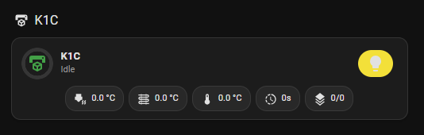
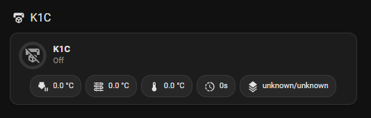
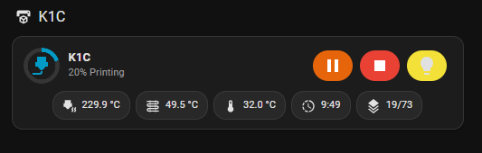
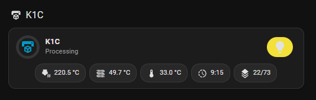

# Creality WebSocket Integration for Home Assistant

This custom [Home Assistant](https://www.home-assistant.io/) integration provides **native, low-latency WebSocket control and telemetry** for Creality K-series and compatible 3D printers. It exposes live state, sensors, controls, and a camera stream. A **standalone Lovelace card** (no external card dependencies) is included.

---

## Features

* **Direct WebSocket** connection (local, no cloud).
* **Push updates**; no polling.
* **States:** `idle`, `printing`, `paused`, `stopped`, `completed`, `error`, `self-testing`.
* **Optional power switch binding** to a `switch` entity for accurate “Off” handling.
* **Entities:** status, progress, time left, temperatures (nozzle/bed/chamber), current layer/total layers, etc.
* **Controls:** pause, resume, stop, light toggle.
* **Camera:** auto-detects stream type by model:
  - K1/K1C/K1 Max: Direct MJPEG stream via Home Assistant (camera included)
  - K1 SE: MJPEG stream (camera is optional accessory)
  - K2 family: **Native WebRTC streaming** using Home Assistant's built-in go2rtc service
  - Ender 3 V3 family: MJPEG stream (camera is optional accessory)
  - Creality Hi: Direct MJPEG stream via Home Assistant (camera included)
* **Lovelace card**: dependency-free, uses HA fonts, progress ring, contextual chips, telemetry pills.
* **Style Editor**: Built-in theme customization with color picker for all card elements.

---

## Installation

### HACS (recommended)

1. Add this repo as a [custom repository](https://hacs.xyz/docs/faq/custom_repositories/) (type: **Integration**).
2. Install **Creality WebSocket Integration**.
3. **Restart** Home Assistant.

### Manual

1. Copy `custom_components/ha_creality_ws` into `<config>/custom_components/`.
2. **Restart** Home Assistant.

### Dependencies

The integration automatically installs the following Python packages:
- `websockets>=10.4` - For WebSocket communication with printers

**Camera Dependencies:**
- **K1 family cameras**: No additional dependencies required (direct MJPEG streaming)
- **K2 family cameras**: Requires Home Assistant's built-in **go2rtc** service for native WebRTC streaming
  - go2rtc is included with Home Assistant core (no HACS installation needed)
  - Automatically available on `localhost:11984` when Home Assistant is running
  - Provides native WebRTC streaming without additional Python packages

---

## Configuration

### 1) Add the integration (UI)

1. **Settings → Devices & Services → Add Integration**
   Select **Creality WebSocket Integration**.
2. Enter printer hostname/IP and a friendly name.
3. Zeroconf discovery is supported; if mDNS works on your network, it will appear automatically.

### 2) Optional: bind a power switch

If your printer power is controlled by a smart plug/switch, bind it so the integration can assert `off` and zero the sensors.

* **Settings → Devices & Services →** your printer **→ Configure**
  Choose the `switch` entity. Submit.

### 3) Optional: camera mode

If auto-detection doesn't choose your preferred stream, you can force it under the integration's Configure dialog:

- **Camera Mode**: 
  - `auto` (default) - Automatically detect based on printer model
  - `mjpeg` - Force direct MJPEG stream (K1 family style)
  - `webrtc` - Force native WebRTC streaming (K2 family style)

**Note:** When forcing `webrtc` mode, the integration will use native WebRTC streaming via Home Assistant's built-in go2rtc service.

---

## Lovelace Card

This repository **bundles** a standalone card. The integration copies the file to `/config/www/ha_creality_ws/k_printer_card.js` on setup and **auto-registers** the Lovelace resource **in storage mode**.

### Card screenshots

Below are example screenshots of the card interface states:

Idle



Off



Printing



Processing



### Resource registration

* **Storage mode (default)**
  The integration registers the resource automatically with cache-busting:

  ```
  /local/ha_creality_ws/k_printer_card.js?v=<build_mtime>   (type: module)
  ```

  If you ever remove/re-add the integration or migrate dashboards, verify it under:
  **Settings → Dashboards → ⋮ → Resources**.

* **YAML mode**
  Add this to your configuration:

  ```yaml
  lovelace:
    resources:
      - url: /local/ha_creality_ws/k_printer_card.js
        type: module
  ```

  (Make sure the file exists at `<config>/www/ha_creality_ws/k_printer_card.js`. The integration deploys it; if it’s missing, restart HA once.)

### Forcing Storage mode (if you previously used YAML)

If you want to switch to storage mode explicitly:

```yaml
# configuration.yaml
lovelace:
  mode: storage
```

Restart HA after changing this.

### **Hard refresh is required after first install/update**

Lovelace caches frontend resources aggressively. After installing/updating the card or integration:

* Desktop: **Ctrl+F5** (Windows/Linux), **⌘+Shift+R** (macOS)
* Mobile app: **App Settings → Reload resources** or force close + reopen.

If you still see stale UI, append a cache-buster query once:

```
/local/ha_creality_ws/k_printer_card.js?v=1
```

Then remove the `?v=` the next time.

---

## Card Usage

The card’s element tag is **`custom:k-printer-card`**.

Add via UI (Manual card) or YAML:

```yaml
type: custom:k-printer-card
name: "K1C Printer"
camera: camera.k1c_printer_camera
status: sensor.k1c_print_status
progress: sensor.k1c_print_progress
time_left: sensor.k1c_print_time_left
nozzle: sensor.k1c_nozzle_temperature
bed: sensor.k1c_bed_temperature
box: sensor.k1c_box_temperature
layer: sensor.k1c_working_layer
total_layers: sensor.k1c_total_layers
light: switch.k1c_light
pause_btn: button.k1c_pause_print
resume_btn: button.k1c_resume_print
stop_btn: button.k1c_stop_print
```

**Behavior:**

* Header icon color + conic progress ring reflect state and progress.
* Chips:

  * **Pause** shown when `printing|resuming|pausing`.
  * **Resume** shown when `paused`.
  * **Stop** shown when `printing|paused|self-testing`.
  * **Light** toggles the configured `switch`/`light` entity.
* Tapping the header opens **more-info** for `camera` (fallbacks: `status`, `progress`).

---

## Style Editor

The card includes a built-in **Style Editor** that allows you to customize the appearance of all card elements. Access it through the card editor's **Theme** tab.

### Features

* **Interactive Color Picker**: Click on any element to open a color picker
* **Live Preview**: See changes applied immediately to the card
* **Theme Persistence**: Customizations are saved and persist across integration updates
* **Auto Mode**: Status and telemetry elements can inherit Home Assistant theme colors
* **Reset to Defaults**: One-click reset to restore original styling

### Customizable Elements

#### Button Colors
- **Pause Button**: Background and icon colors
- **Resume Button**: Background and icon colors  
- **Stop Button**: Background and icon colors
- **Light Button**: Background and icon colors (separate for on/off states)
  - Light On Background & Icon
  - Light Off Background & Icon

#### Status Elements
- **Status Icon**: Color (auto mode inherits theme colors)
- **Progress Ring**: Color (auto mode inherits theme colors)
- **Status Background**: Background color (auto mode uses card background)

#### Telemetry Elements
- **Telemetry Icons**: Color (auto mode inherits secondary text color)
- **Telemetry Text**: Color (auto mode inherits primary text color)

### Usage

1. **Open Card Editor**: Click the card's menu (⋮) → **Edit**
2. **Switch to Theme Tab**: Click the **Theme** tab in the editor
3. **Customize Colors**: 
   - Click on any element to open its color picker
   - Use the color preview square to open the native color picker
   - Type hex codes directly (e.g., `#ff0000`)
   - Type `auto` to inherit Home Assistant theme colors
4. **Save Changes**: Click **Save** on the color picker, then **Save** on the card
5. **Reset**: Use the **Reset to Defaults** button to restore original styling

### Color Formats

- **Hex Colors**: Use standard hex format (e.g., `#ff0000`, `#00ff00`)
- **Auto Mode**: Type `auto` to inherit Home Assistant theme colors
- **Theme Integration**: Auto mode automatically adapts to light/dark themes

### Persistence

Your customizations are automatically saved and will persist across:
- Home Assistant restarts
- Integration updates
- Dashboard reloads

The theme data is stored per card instance, so each card can have its own unique styling.

---

## Troubleshooting

* **"Configuration error" in picker or blank card**
  Hard refresh Lovelace. Verify the resource exists (see *Resource registration*). Ensure the element type is `custom:k-printer-card`.
* **Controls do nothing**
  Confirm the `pause_btn`, `resume_btn`, `stop_btn` entities exist and are `button.*`. The card calls `button.press`.
  Confirm the light entity domain is `switch` or `light`.
* **Wrong states when powered off**
  Set the **Power Switch** in the integration's Configure dialog.
* **Resource missing in storage mode**
  Remove + re-add the integration or add the resource manually under **Dashboards → Resources** pointing to `/local/ha_creality_ws/k_printer_card.js`.
* **WebRTC camera not working**
  If K2 family cameras show fallback images instead of live video:
  1. **Verify go2rtc is running**: Check `http://localhost:11984` in your browser
  2. **Check go2rtc status**: Visit `http://localhost:11984/api/streams` to see configured streams
  3. Ensure the printer's WebRTC signaling endpoint is accessible
  4. Verify the printer supports WebRTC (K2 family only)
  5. Check Home Assistant logs for WebRTC negotiation errors
  6. **Note**: go2rtc is included with Home Assistant core - no additional installation needed
* **K2 camera shows no image**
  - Check that the printer's WebRTC endpoint is accessible
  - Verify the printer model is correctly detected (check logs for "detected K2 family printer")
  - Ensure Home Assistant's built-in go2rtc service is running
  - Check for WebRTC message format errors in logs
* **Manual camera mode not working**
  - Check logs for "user forced [mode] mode" messages
  - Verify the camera mode is set correctly in the integration's Configure dialog
  - Restart Home Assistant after changing camera mode settings
  - For `webrtc` mode: ensure Home Assistant's built-in go2rtc service is running

---

## Camera specifics by model

- The integration auto-detects the printer model and creates the appropriate camera entity:
  - **K1/K1C/K1 Max**: Direct MJPEG camera (camera included). Works with all Home Assistant camera cards (Picture Glance, Picture Entity, etc.)
  - **K1 SE**: MJPEG camera (optional accessory - gracefully handles when not present)
  - **K2 family**: **Native WebRTC camera**. Provides native WebRTC streaming using Home Assistant's built-in go2rtc service
  - **Ender 3 V3 family**: MJPEG camera (optional accessory - gracefully handles when not present)
  - **Creality Hi**: Direct MJPEG camera (camera included)

- **Native WebRTC streaming**: For K2 printers, the integration:
  - Uses Home Assistant's built-in go2rtc service for WebRTC streaming
  - Configures go2rtc to connect to the printer's WebRTC signaling endpoint
  - Forwards WebRTC offers/answers between Home Assistant frontend and go2rtc
  - Provides native WebRTC streaming without additional HACS integrations
  - Works with all standard Home Assistant camera cards that support WebRTC

- **Dependencies**: WebRTC functionality uses Home Assistant's built-in go2rtc service. Only `websockets` Python package is required.

---

## Status / Testing

Currently verified on:
- **Creality K1C** - Full functionality including box temperature and light controls
- **Creality Ender 3 V3 KE** - Full functionality (no box temperature or light controls, optional camera)

## Supported Models

### K1 Family
- **K1** - Box temperature sensor & control, light, MJPEG camera
- **K1C** - Box temperature sensor only (no control), light, MJPEG camera  
- **K1 SE** - No box temperature, no light, optional MJPEG camera
- **K1 Max** - Box temperature sensor & control, light, MJPEG camera

### K2 Family
- **K2** - Box temperature sensor only (no control), light, WebRTC camera
- **K2 Pro** - Box temperature sensor & control, light, WebRTC camera
- **K2 Plus** - Box temperature sensor & control, light, WebRTC camera

### Ender 3 V3 Family
- **Ender 3 V3** - No box temperature, no light, optional MJPEG camera
- **Ender 3 V3 KE** - No box temperature, no light, optional MJPEG camera
- **Ender 3 V3 Plus** - No box temperature, no light, optional MJPEG camera

### Other Models
- **Creality Hi** - Box temperature sensor & control, light, MJPEG camera

Other K-series models may work but are unverified.

---

## Diagnostic Service

The integration provides a diagnostic service to help with troubleshooting and understanding what data different printer models send via WebSocket.

### Usage

1. Go to **Developer Tools** → **Services**
2. Select service: `ha_creality_ws.diagnostic_dump`
3. Click **Call Service**
4. **Copy the diagnostic data** from the service response in the UI

The service will return the complete diagnostic data in the response that you can copy and paste directly. The data is also saved to a file in your Home Assistant config directory as a backup.

**Service Response includes:**

- **Complete WebSocket telemetry data** from all connected printers
- **Model detection results** showing how each printer is classified
- **Feature detection results** showing which features are enabled/disabled
- **Printer status information** (availability, power state, etc.)
- **Home Assistant and integration version information**

### What's Included

The diagnostic file contains:
- All raw telemetry data received from the printer
- Model detection logic results (K1, K2, Ender 3 V3, etc.)
- Feature detection results (camera type, light, box temperature, etc.)
- Connection status and timing information
- Integration configuration details

### Sharing Diagnostic Data

The diagnostic data can be safely shared with developers for troubleshooting. It contains only telemetry data and configuration information - no sensitive personal data.

**How to share:**
1. Call the service as described above
2. Copy the `diagnostic_data` field from the service response
3. Paste it into a text file or share directly with developers

**Service Response Format:**
```json
{
  "diagnostic_data": "{...complete JSON data...}",
  "file_path": "/config/creality_diagnostic_20241220_143022.json",
  "data_size": 12345,
  "printers_count": 1
}
```

**Note**: The data is also saved to a file in your Home Assistant config directory as a backup, but the UI response is the primary way to access it.

---

## License

MIT. See `LICENSE`.
